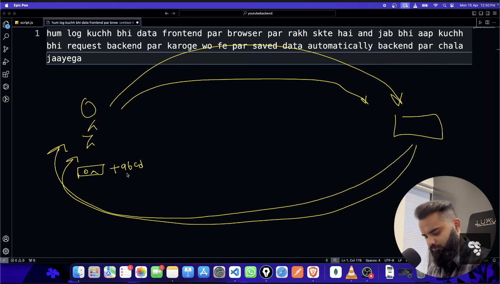

- we can put any data on the frontend of the browser
- when we request any from backend

# Cookie and Session

## Cookie

A **cookie** is a small piece of data stored on the client-side (user's browser) by a web server. It persists across browser sessions and is automatically sent with every HTTP request to the same domain.

**Key characteristics:**

- Stored in the browser
- Has an expiration time
- Limited to ~4KB in size
- Sent automatically with each request
- Can be accessed by client-side JavaScript (unless HttpOnly flag is set)

**Common uses:** Authentication tokens, user preferences, tracking, shopping cart data

---

## Session

A **session** is a server-side storage mechanism that maintains user state across multiple requests. The server stores session data and sends a unique session identifier (usually via cookie) to the client.

**Key characteristics:**

- Stored on the server
- Expires when user closes browser or after timeout
- No size limit (depends on server resources)
- Only session ID is sent to client
- Data cannot be accessed by client-side code

**Common uses:** User authentication state, temporary data, shopping cart, form data across pages

---

## Key Difference

- **Cookie**: Client stores the actual data
- **Session**: Server stores the data, client only holds the session ID

- Time frame between login and logout is called cassion.
- At the time of login, cookie will be generates and each time when we send any request to the web server that cookie are goes along with that to get verified. and this is called cookie.

- When we send any data like email and name to the server and that data are not goes as text then goes in the the form of blob like stram of data and that is not like human readable.
- I send plain taxt but server gets which not directly readable
- So now we have to make readable.

# Express Middleware Explanation

## app.use(express.json())

This middleware parses incoming requests with **JSON payloads** and makes the parsed data available in `req.body`.

**What it does:**

- Intercepts requests with `Content-Type: application/json`
- Parses the JSON string from the request body
- Converts it into a JavaScript object
- Attaches it to `req.body`

**Example:**

```javascript
// Client sends:
POST /api/users
Content-Type: application/json

{"name": "John", "age": 25}

// Server receives in req.body:
req.body.name // "John"
req.body.age  // 25
```

---

## app.use(express.urlencoded({extended: true}))

This middleware parses incoming requests with **URL-encoded payloads** (typically from HTML forms) and makes the parsed data available in `req.body`.

**What it does:**

- Intercepts requests with `Content-Type: application/x-www-form-urlencoded`
- Parses the URL-encoded string from the request body
- Converts it into a JavaScript object
- Attaches it to `req.body`

**The `extended` option:**

- `extended: true` - Uses the `qs` library (supports nested objects and arrays)
- `extended: false` - Uses the `querystring` library (simple key-value pairs only)

**Example:**

```javascript
// Client sends (HTML form):
POST /api/users
Content-Type: application/x-www-form-urlencoded

name=John&age=25

// Server receives in req.body:
req.body.name // "John"
req.body.age  // "25"
```

**With extended: true (nested objects):**

```javascript
// URL-encoded: user[name]=John&user[age]=25
// Parsed as:
req.body.user.name; // "John"
req.body.user.age; // "25"
```

---

## Summary

| Middleware             | Parses    | Content-Type                        | Use Case                 |
| ---------------------- | --------- | ----------------------------------- | ------------------------ |
| `express.json()`       | JSON data | `application/json`                  | REST APIs, AJAX requests |
| `express.urlencoded()` | Form data | `application/x-www-form-urlencoded` | HTML form submissions    |

**Both are required** if your application handles both JSON API requests and traditional form submissions.

# 🛠️ Understanding Express Body Parsers

These two lines of code are used in an Express.js application to process data sent from a client (like a web browser or another application) in the body of an **HTTP request** (especially for `POST` and `PUT` methods).

They configure **middleware** that intercepts the incoming request stream and makes the request body available on the `req.body` property.

---

## 1. `app.use(express.json());`

- **Purpose:** This middleware is responsible for parsing incoming request bodies that are in the **JSON** format.
- **How it Works:** When a client sends a request with the `Content-Type: application/json` header, this middleware reads the JSON data from the request stream, parses it into a **JavaScript object**, and then attaches that object to `req.body`.
- **Example:** If a client sends:
  ```json
  {
    "username": "user123",
    "email": "user@example.com"
  }
  ```
  ...then after this middleware runs, you can access the data in your route handler like this:
  ```javascript
  app.post("/api/users", (req, res) => {
    console.log(req.body.username); // 'user123'
    // ... your logic
  });
  ```

---

## 2. `app.use(express.urlencoded({extended: true}));`

- **Purpose:** This middleware is responsible for parsing incoming request bodies that are in the **URL-encoded** format. This is the format typically used when submitting data through an **HTML form** without file uploads.
- **How it Works:** It reads the data from the request body, which looks like a URL query string (`key=value&key2=value2`), and parses it into a **JavaScript object** attached to `req.body`.
- **The `{extended: true}` Option:**
  - `true` (Recommended): Allows for rich data structures (like nested objects and arrays) to be encoded in the URL-encoded format. It uses the `qs` library for parsing.
  - `false`: Uses the classic `querystring` library, which only supports simple key/value pairs.
- **Example:** If a client sends data that, when parsed, corresponds to: `item=laptop&details[color]=silver`
  ...then after this middleware runs, you can access the data:
  ```javascript
  app.post("/api/products", (req, res) => {
    console.log(req.body.item); // 'laptop'
    console.log(req.body.details.color); // 'silver' (because `extended: true` is set)
    // ... your logic
  });
  ```

---

## 💡 Summary

| Code Line              | Purpose                                             | `Content-Type` Header               | `req.body` Format |
| :--------------------- | :-------------------------------------------------- | :---------------------------------- | :---------------- |
| `express.json()`       | Parse **JSON** data.                                | `application/json`                  | JavaScript Object |
| `express.urlencoded()` | Parse **URL-encoded** data (e.g., from HTML forms). | `application/x-www-form-urlencoded` | JavaScript Object |

---

Would you like to see a complete minimal example of how these are used in an Express server setup?


